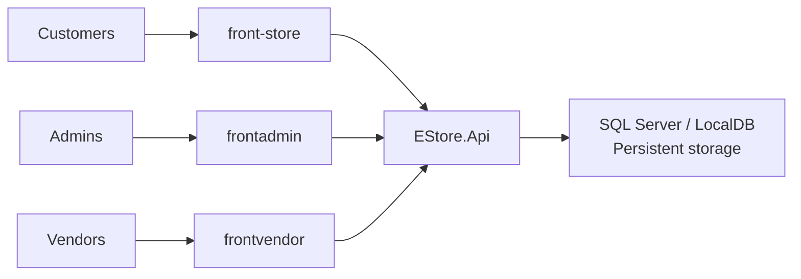
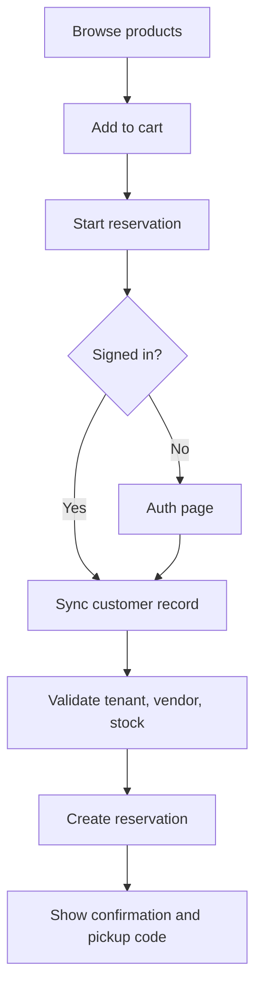
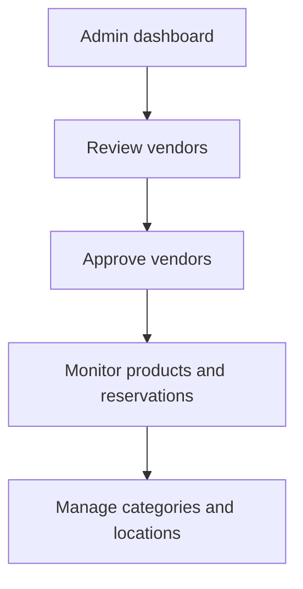

# Stere8 EStore Platform

Presentation draft

Prepared: April 7, 2026  
Repository state: `main` at commit `c96212c`  
Working repo: `E:\Workspace\03_Projects\stere8\store`

---

## Slide 1. Title

**Stere8 EStore Platform**

Reservation-first, multi-vendor retail platform for mall and pickup commerce

- Single .NET backend authority
- Separate customer, admin, and vendor applications
- Reservation workflow instead of payment-first checkout
- Built for multi-tenant retail operations

---

## Slide 2. One-Minute Pitch

Stere8 EStore is a platform for malls and multi-vendor retail environments where customers browse products online, reserve items for pickup, and operational teams manage vendors, products, locations, and reservations from a central admin console.

What makes it different:

- It is not just a storefront
- It is not just an admin panel
- It is an API-centered retail operating platform
- It fits reserve-and-pickup commerce better than traditional ecommerce checkouts

---

## Slide 3. Agenda

This presentation covers:

1. Business problem
2. Product vision
3. Current solution
4. Architecture and apps
5. Key workflows
6. Recent progress
7. Technical status
8. Risks and gaps
9. Recommended roadmap
10. Demo path

---

## Slide 4. Business Problem

Many physical retail environments do not need or cannot rely on a pure payment-first ecommerce model.

Typical problems:

- Mall stores need inventory visibility and reservation handling
- Customers want item certainty before traveling to collect goods
- Operators need tenant-aware control over many vendors
- Vendor onboarding often needs moderation and approval
- Separate business roles need different interfaces, not one overloaded application

This creates a gap between simple ecommerce storefronts and real operational retail tools.

---

## Slide 5. Product Opportunity

There is strong value in a platform that supports:

- multi-vendor catalog visibility
- reserve-and-pickup commerce
- admin governance
- vendor onboarding control
- centralized operational reporting

The platform can serve:

- malls
- retail hubs
- pickup-first local commerce environments
- merchant collectives
- marketplace-style physical retail operators

---

## Slide 6. Vision

**Vision:** create a modular commerce platform where a mall or retail operator can onboard vendors, expose customer browsing, manage inventory-backed reservations, and govern the whole environment through one backend source of truth.

Core principles:

- API-first and backend-centered
- multi-tenant ready
- reservation-first, not payment-only
- role-separated frontend applications
- incremental expansion without losing architecture clarity

---

## Slide 7. Product Positioning

Stere8 EStore sits between:

- traditional ecommerce storefronts that are weak on operations
- marketplace admin tools that are weak on customer experience

It combines both sides:

- customer-facing discovery and reservation
- admin-facing operational control
- vendor-facing future self-service capability

That makes it a platform product rather than a narrow app.

---

## Slide 8. High-Level Solution

The current solution has four main applications:

1. `EStore.Api`
2. `front-store`
3. `frontadmin`
4. `frontvendor`

All frontends use the .NET API as the system of record.

---

## Slide 9. Current Applications

### `EStore.Api`

- Backend source of truth
- Minimal API structure
- Handles business rules and domain orchestration

### `front-store`

- Customer storefront
- Product browsing
- Cart and reservation workflow

### `frontadmin`

- Admin operations console
- Vendor, product, category, location, and reservation visibility

### `frontvendor`

- Vendor-specific frontend foundation
- Separate app prepared for merchant workflows

---

## Slide 10. Why Separate Frontends

The platform deliberately separates customer, admin, and vendor experiences.

Benefits:

- cleaner UI ownership
- clearer role boundaries
- simpler long-term scaling
- lower risk of mixing admin and merchant logic
- easier deployment and product evolution

This is a stronger long-term decision than trying to keep everything inside one frontend.

---

## Slide 11. Backend Architecture

`EStore.Api` is the platform core.

Key architecture characteristics:

- ASP.NET minimal APIs
- `AppDbContext` for application data
- SQL Server / LocalDB support
- persistent database required at startup
- CORS and Swagger enabled for development workflows
- tenant extraction from request context
- grouped endpoint modules
- demo catalog seeding

The backend is intentionally positioned as the durable business contract of the system.

---

## Slide 12. Core Domains

The current domain model covers:

- tenants
- locations
- vendors
- categories
- products
- customers
- shopping carts
- cart items
- reservations
- reservation items
- reviews

This is already enough to represent a credible operational retail workflow rather than just a static catalog demo.

---

## Slide 13. Core Capabilities

The platform currently supports:

- tenant-aware requests
- vendor registration
- vendor approval
- product creation, update, listing, and deactivation
- category management
- location management
- customer upsert and retrieval
- cart management
- reservation creation
- reservation retrieval
- reservation status handling
- review creation and listing
- demo data seeding for local environments

---

## Slide 14. Reservation-First Commerce Model

Traditional ecommerce usually centers around online payment.

This platform currently centers around reservation:

- customer selects products
- customer authenticates
- customer profile is synchronized into the API
- reservation is created against available stock
- pickup code is issued
- admin and vendor workflows can operate around the reservation lifecycle

This makes the model especially useful for pickup-first retail operations.

---

## Slide 15. Why Reservation Commerce Matters

Reservation commerce is valuable when:

- payment should happen physically at pickup
- stock certainty is more important than online payment capture
- stores need to reduce no-show and allocation ambiguity
- mall operators want centralized visibility of item holds

This gives the project a clear operational identity and a strong differentiator.

---

## Slide 16. Customer Journey

Customer experience highlights:

- purpose-built auth pages
- return-to-flow behavior after sign-in
- API customer synchronization
- reservation confirmation page
- pickup code generated for collection

---

## Slide 17. Customer Value

For customers, the system provides:

- product discovery
- lower friction than restarting checkout after auth
- clear reservation confirmation
- pickup confidence
- visibility into reservation status and details

The platform is beginning to feel like a coherent retail product rather than a set of disconnected screens.

---

## Slide 18. Admin Journey

Admin workflows now include:

- vendor listing and visibility
- vendor creation
- vendor approval
- location and category management
- product visibility
- reservation visibility

This establishes the admin app as the governance layer of the platform.

---

## Slide 19. Vendor Journey

The vendor app is earlier in maturity, but the direction is correct.

Current value:

- dedicated vendor frontend exists
- no longer overloaded into admin
- prepared for future merchant dashboard workflows

Near-future vendor capabilities should include:

- profile management
- reservation fulfillment visibility
- product management by vendor role
- vendor-specific analytics

---

## Slide 20. Reservation Lifecycle

Reservations are not treated as simple checkout records. They have a controlled lifecycle.

Typical statuses:

- Pending
- Confirmed
- Completed
- Rejected
- Cancelled

Operational logic includes:

- stock hold on creation
- guarded status transitions
- stock release on cancellation or rejection
- expiration maintenance for pending reservations

This is one of the most important technical strengths in the current system.

---

## Slide 21. Tenant Awareness

The API includes tenant-aware request behavior, allowing:

- data isolation by tenant
- mall or operator separation
- tenant-scoped vendors, products, customers, and reservations

This is important because it means the architecture is already thinking beyond a single hard-coded store deployment.

---

## Slide 22. Recent Progress

The latest verified `main` state includes a meaningful improvement set:

- vendor approval endpoint in the API
- admin UI support for vendor approval
- customer auth wrapper for storefront sign-in and sign-up
- auth resume state to preserve checkout intent
- customer-to-API synchronization after auth
- reservation confirmation page
- cleaner repo hygiene around frontend generated artifacts

These changes materially improved the end-to-end product story.

---

## Slide 23. Vendor Approval Flow

The admin app now supports moderated vendor onboarding.

What exists now:

- pending vs verified vendor status visibility
- approval action from the admin vendors list
- backend endpoint to mark vendors verified
- vendor detail messaging aligned to the new capability

Why this matters:

- gives operators control
- improves trust
- supports quality gating before vendors become fully active in the ecosystem

---

## Slide 24. Customer Auth Integration

The storefront auth flow was improved from generic auth screens to a project-specific experience.

What changed:

- auth screens now use a custom page wrapper
- resume-state logic preserves intended return path
- customer profile is synchronized into `EStore.Api`
- reservation attempts can continue after sign-in

Impact:

- better UX continuity
- better data consistency
- better alignment between identity and reservation ownership

---

## Slide 25. Technical Stack

### Backend

- .NET 8
- ASP.NET minimal APIs
- Entity Framework Core
- SQL Server / LocalDB

### Frontend

- Next.js
- React
- TypeScript
- Clerk for auth in `front-store`

### Development support

- Swagger
- seeded demo catalog
- multi-app local environment

---

## Slide 26. Current Strengths

The project is already strong in several ways:

- clear backend ownership of business rules
- role-separated frontend strategy
- credible domain model
- reservation lifecycle logic
- admin governance capability
- end-to-end user flow that can be demonstrated live
- validated builds across API and frontends

This makes it presentation-ready for both product and engineering audiences.

---

## Slide 27. Current Weaknesses and Gaps

The project should still be presented honestly.

Known gaps:

- vendor update, activation, suspension, and delete workflows are incomplete
- payment is not yet a core implemented path
- role enforcement and production hardening need deeper attention
- automated testing needs to be stronger around reservation behavior
- some local environment hygiene still needs standardization

These are roadmap gaps, not architectural failures.

---

## Slide 28. Delivery Status

Current verified status:

- `main` contains the latest integrated source work
- API builds successfully
- `front-store` builds successfully
- `frontadmin` builds successfully
- `frontvendor` builds successfully after dependency installation
- `frontadmin` lint completes successfully

This gives the project a defensible current-state claim: the core stack is operational, not theoretical.

---

## Slide 29. Demo Narrative

Recommended live demo flow:

1. Show storefront home or product browsing
2. Add items to cart
3. Trigger reservation flow
4. Show auth redirect and return behavior
5. Complete reservation
6. Show reservation confirmation and pickup code
7. Open admin vendors screen
8. Show approval status and controls
9. Show products, reservations, and other admin visibility
10. Close with architecture and roadmap

This sequence tells one coherent business and technical story.

---

## Slide 30. Suggested Audience Framing

### Business audience

- focus on mall operations
- focus on reserve-and-pickup convenience
- focus on vendor governance
- focus on scalability potential

### Technical audience

- focus on API as source of truth
- focus on tenant-aware architecture
- focus on reservation lifecycle logic
- focus on separated frontends

### Product audience

- focus on journey continuity
- focus on role clarity
- focus on roadmap credibility

---

## Slide 31. Recommended Roadmap

### Phase 1. Stabilize

- formalize lint and test strategy
- standardize environment setup
- harden repository hygiene
- add targeted reservation and admin workflow tests

### Phase 2. Expand operations

- vendor profile editing
- vendor activation and suspension
- richer reservation operational views
- stronger vendor self-service support

### Phase 3. Deepen commerce

- payment support
- notifications
- analytics and reporting
- role-based access strengthening
- deployment pipeline and production hardening

---

## Slide 32. 30 / 60 / 90 Day Practical Plan

### 30 days

- close admin API gaps
- stabilize local environment and branch hygiene
- add tests around reservations and vendor approval

### 60 days

- expand vendor workflows
- improve reservation operations
- add stronger admin reporting visibility

### 90 days

- payment and notification strategy
- production-readiness review
- deployment and access control hardening

---

## Slide 33. Why This Project Is Valuable

This project already demonstrates:

- real domain design
- workflow orchestration
- platform thinking
- admin governance
- customer journey continuity
- future-ready frontend separation

It is not just a UI prototype. It is a legitimate foundation for a retail operations platform.

---

## Slide 34. Closing

**Stere8 EStore is becoming a retail operating platform.**

Current reality:

- one backend source of truth
- role-specific frontends
- reservation-first commerce model
- vendor governance in admin
- end-to-end flow already working

Next objective:

stabilize, deepen merchant operations, and expand from reservation commerce into a production-grade retail platform.

---

## Appendix A. Build Verification Snapshot

The verified working session included:

- `dotnet build E-Store.sln`
- `npm run build` in `front-store`
- `npm run build` in `frontadmin`
- `npm install` and `npm run build` in `frontvendor`
- `npm run lint` in `frontadmin`

Notes:

- `front-store` build completed successfully
- `frontadmin` build completed successfully
- `frontvendor` build completed successfully after dependency installation
- `front-store` lint remained interactive because Next.js requested ESLint setup

---

## Appendix B. Presenter Notes

If presenting to executives or clients:

- start with the problem
- keep architecture short until value is clear
- show the reservation flow early
- use vendor approval as proof of governance
- end with roadmap and platform potential

If presenting to engineers:

- start with architecture and domain model
- explain reservation lifecycle and stock behavior
- explain why frontends are separated
- call out current gaps honestly
- finish with stabilization priorities

If presenting to investors or sponsors:

- position the system as infrastructure for multi-vendor physical retail
- emphasize operational control and pickup-first commerce
- show that the architecture supports expansion into a broader retail platform
