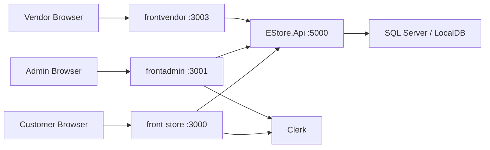

<p align="center">
  
</p>

<p align="center">
  
  
</p>

<h1 align="center">E-Mall Rwanda</h1>

<p align="center">
  Multi-vendor commerce platform for Rwanda, with a SQL Server backend, customer storefront, admin console, and vendor portal.
</p>

---

## Project overview

E-Mall Rwanda is the active marketplace stack in this workspace.

It is built around a single source of truth:

- [EstorePoC/EStore.Api](./EstorePoC/EStore.Api) for data, business rules, migrations, and seeded demo content

And three frontends:

- [front-store](./front-store) for customers
- [frontadmin](./frontadmin) for administrators
- [frontvendor](./frontvendor) for vendors

This repository is no longer centered on the old Mongo-first architecture. The active local-development path is:

1. SQL Server / LocalDB
2. `EStore.Api`
3. `front-store`
4. `frontadmin`
5. `frontvendor`

## What the platform includes

### Customer side

- branded E-Mall Rwanda storefront
- product browsing
- category browsing
- cart and reservation flow
- customer sign-in and sign-up through Clerk
- order and reservation tracking

### Admin side

- vendor management
- product management
- category management
- reservation monitoring
- customer lookup
- location management

### Vendor side

- vendor-facing frontend connected to the same API
- tenant-aware API access
- reservation and product-oriented portal development path

## Workspace map

| Area | Path | Default local URL | Notes |
| --- | --- | --- | --- |
| API | `EstorePoC/EStore.Api` | `http://localhost:5000` | .NET 8, EF Core, SQL Server, Swagger |
| Storefront | `front-store` | `http://localhost:3000` | Customer-facing E-Mall Rwanda app |
| Admin | `frontadmin` | `http://localhost:3001` | Admin frontend aligned to `EStore.Api` |
| Vendor | `frontvendor` | `http://localhost:3003` | Vendor frontend |
| Start script | `run_all.bat` | n/a | Starts API + frontends on Windows |
| Stop script | `stop-all.bat` | n/a | Stops the local dev stack on Windows |

## Architecture



## Prerequisites

Before you run anything, install and verify these:

- Windows with PowerShell
- `.NET SDK 8.0.415` or another compatible `.NET 8` SDK matching [global.json](./global.json)
- Node.js `20.x` LTS or newer
- `npm`
- SQL Server Express LocalDB or a full SQL Server instance
- `sqlcmd` if you want explicit database creation from the terminal
- a Clerk project for authentication in `front-store` and `frontadmin`
- optional: `ngrok` for Clerk webhook testing

Useful checks:

```powershell
dotnet --version
node --version
npm --version
sqllocaldb info
sqlcmd -?
```

## Local URLs

When everything is running locally, these are the main URLs:

- Storefront: `http://localhost:3000`
- Admin: `http://localhost:3001`
- Vendor: `http://localhost:3003`
- API: `http://localhost:5000`
- Swagger: `http://localhost:5000/swagger`
- Health endpoint: `http://localhost:5000/health`

## One-time setup

From the repository root:

```powershell
cd E:\Workspace\03_Projects\stere8\store
```

Install API dependencies:

```powershell
cd .\EstorePoC\EStore.Api
dotnet restore
```

Install frontend dependencies:

```powershell
cd ..\..\front-store
npm install

cd ..\frontadmin
npm install

cd ..\frontvendor
npm install
```

## Database setup

`EStore.Api` requires a real SQL Server connection.

The old in-memory fallback has been removed.

### Recommended setup: LocalDB on Windows

The default connection string already points to LocalDB in:

- [EstorePoC/EStore.Api/appsettings.json](./EstorePoC/EStore.Api/appsettings.json)
- [EstorePoC/EStore.Api/appsettings.Development.json](./EstorePoC/EStore.Api/appsettings.Development.json)

Default database name:

- `EStore_MultiVendor_Dev`

### Step 1: verify LocalDB

```powershell
sqllocaldb info
```

If `MSSQLLocalDB` is missing:

```powershell
sqllocaldb create MSSQLLocalDB
sqllocaldb start MSSQLLocalDB
```

### Step 2: create the database explicitly

This is optional, but recommended because it makes the local setup very clear:

```powershell
sqlcmd -S "(localdb)\MSSQLLocalDB" -Q "IF DB_ID('EStore_MultiVendor_Dev') IS NULL CREATE DATABASE [EStore_MultiVendor_Dev]"
```

### Step 3: know the default connection string

```text
Data Source=(localdb)\MSSQLLocalDB;Initial Catalog=EStore_MultiVendor_Dev;Integrated Security=True;Persist Security Info=False;Pooling=False;MultipleActiveResultSets=False;Encrypt=True;TrustServerCertificate=True;Application Name="EStore.Api"
```

### Alternative: use full SQL Server / MSSQL

If you want to use SQL Server Developer, SQL Express, or a remote MSSQL instance instead of LocalDB:

1. Create the database:

```powershell
sqlcmd -S "localhost" -U "sa" -P "<YOUR_SQL_PASSWORD>" -Q "IF DB_ID('EStore_MultiVendor_Dev') IS NULL CREATE DATABASE [EStore_MultiVendor_Dev]"
```

2. Override the connection string for the current shell:

```powershell
$env:ConnectionStrings__DefaultConnection = "Server=localhost;Database=EStore_MultiVendor_Dev;User Id=sa;Password=<YOUR_SQL_PASSWORD>;Encrypt=True;TrustServerCertificate=True"
```

3. Or put your machine-specific connection string into:

- [EstorePoC/EStore.Api/appsettings.Development.json](./EstorePoC/EStore.Api/appsettings.Development.json)

Do not commit personal SQL credentials.

## Migrations and schema creation

`EStore.Api` applies migrations automatically on startup.

Still, it is useful to know the explicit commands.

### Apply migrations manually

```powershell
cd E:\Workspace\03_Projects\stere8\store\EstorePoC\EStore.Api
dotnet tool install --global dotnet-ef
dotnet ef database update
```

### Create a new migration later

```powershell
cd E:\Workspace\03_Projects\stere8\store\EstorePoC\EStore.Api
dotnet ef migrations add <MigrationName>
dotnet ef database update
```

### Important startup behavior

When the API starts:

- EF Core migrations are applied
- LocalDB recovery logic can remove broken stale LocalDB catalog entries
- demo catalog data is seeded automatically if the tenant catalog is empty
- the default tenant id is `kigali-city-mall`

## Run the API

Start the backend first:

```powershell
cd E:\Workspace\03_Projects\stere8\store\EstorePoC\EStore.Api
dotnet run --launch-profile http
```

You can also use:

```powershell
dotnet run
```

But `--launch-profile http` is the clearest local option because it binds to the expected local HTTP URL.

Once it is running, check:

```powershell
start http://localhost:5000/swagger
```

## Environment files

The repo already includes examples:

- [front-store/.env.example](./front-store/.env.example)
- [frontadmin/.env.example](./frontadmin/.env.example)
- [frontvendor/.env.example](./frontvendor/.env.example)

Copy each one to `.env.local` before running the app.

---

## Storefront setup

Path:

- [front-store](./front-store)

Create `front-store/.env.local`:

```env
NEXT_PUBLIC_SERVER_URL=http://localhost:3000

NEXT_PUBLIC_ESTORE_API_URL=http://localhost:5000
NEXT_PUBLIC_API_URL=http://localhost:5000
NEXT_PUBLIC_ESTORE_TENANT_ID=kigali-city-mall

NEXT_PUBLIC_CLERK_PUBLISHABLE_KEY=<YOUR_CLERK_PUBLISHABLE_KEY>
CLERK_SECRET_KEY=<YOUR_CLERK_SECRET_KEY>
NEXT_PUBLIC_CLERK_SIGN_IN_URL=/sign-in
NEXT_PUBLIC_CLERK_SIGN_UP_URL=/sign-up

# Optional: only needed for Clerk webhook testing
CLERK_WEBHOOK_SECRET=whsec_your_clerk_webhook_secret

# Optional: only needed if you test Stripe storefront flows
NEXT_PUBLIC_STRIPE_PUBLISHABLE_KEY=<YOUR_STRIPE_PUBLISHABLE_KEY>
```

Run it:

```powershell
cd E:\Workspace\03_Projects\stere8\store\front-store
npm run dev
```

Useful notes:

- preferred API variable: `NEXT_PUBLIC_ESTORE_API_URL`
- also set `NEXT_PUBLIC_API_URL` because some older code paths still read it
- default tenant id: `kigali-city-mall`
- default local URL: `http://localhost:3000`

## Admin setup

Path:

- [frontadmin](./frontadmin)

Create `frontadmin/.env.local`:

```env
NEXT_PUBLIC_SERVER_URL=http://localhost:3001

NEXT_PUBLIC_ESTORE_API_URL=http://localhost:5000
NEXT_PUBLIC_API_URL=http://localhost:5000
NEXT_PUBLIC_ESTORE_TENANT_ID=kigali-city-mall
NEXT_PUBLIC_ESTORE_CURRENCY=USD

NEXT_PUBLIC_CLERK_PUBLISHABLE_KEY=<YOUR_CLERK_PUBLISHABLE_KEY>
CLERK_SECRET_KEY=<YOUR_CLERK_SECRET_KEY>
NEXT_PUBLIC_CLERK_SIGN_IN_URL=/sign-in
NEXT_PUBLIC_CLERK_SIGN_UP_URL=/sign-up
```

Run it:

```powershell
cd E:\Workspace\03_Projects\stere8\store\frontadmin
npm run dev
```

Default local URL:

- `http://localhost:3001`

Current admin coverage:

- dashboard
- vendors
- products
- categories
- reservations
- customers
- locations

Important note:

- some legacy admin code still exists in the repo
- the active admin integration path is the `EStore.Api`-aligned app, not the old Mongo-based flow

## Vendor setup

Path:

- [frontvendor](./frontvendor)

Create `frontvendor/.env.local`:

```env
NEXT_PUBLIC_ESTORE_API_URL=http://localhost:5000
NEXT_PUBLIC_API_URL=http://localhost:5000
NEXT_PUBLIC_ESTORE_TENANT_ID=kigali-city-mall
```

Run it:

```powershell
cd E:\Workspace\03_Projects\stere8\store\frontvendor
npm run dev
```

Default local URL:

- `http://localhost:3003`

## Fastest way to run the full stack on Windows

If you want separate terminals launched automatically:

```powershell
cd E:\Workspace\03_Projects\stere8\store
.\run_all.bat
```

This script starts:

- API on port `5000`
- Admin on port `3001`
- Storefront on port `3000`
- Vendor frontend on port `3003`

To stop them:

```powershell
cd E:\Workspace\03_Projects\stere8\store
.\stop-all.bat
```

## Default tenant and seeded demo data

The local development stack uses this tenant id by default:

- `kigali-city-mall`

The API seeds demo data for that tenant, including:

- locations
- categories
- vendors
- customers
- products
- shopping carts
- reviews
- reservations

That means a fresh local setup is not empty after the first successful API start.

## Useful commands

### Build everything

```powershell
cd E:\Workspace\03_Projects\stere8\store\EstorePoC\EStore.Api
dotnet build

cd E:\Workspace\03_Projects\stere8\store\front-store
npm run build

cd E:\Workspace\03_Projects\stere8\store\frontadmin
npm run build

cd E:\Workspace\03_Projects\stere8\store\frontvendor
npm run build
```

### Reconcile Clerk users into the SQL database

From the storefront app:

```powershell
cd E:\Workspace\03_Projects\stere8\store\front-store
npm run reconcile:clerk-customers
```

Required variables for that script:

- `CLERK_SECRET_KEY`
- `NEXT_PUBLIC_ESTORE_API_URL`
- `NEXT_PUBLIC_ESTORE_TENANT_ID`

## Optional local webhook testing for Clerk

If you want Clerk webhook events to reach your local storefront:

1. Start `front-store`
2. Start `ngrok`
3. Point Clerk webhooks to your ngrok URL
4. Set `CLERK_WEBHOOK_SECRET` in `front-store/.env.local`

Manual example:

```powershell
ngrok http 3000
```

The Windows helper script can also offer to start ngrok for you.

## Troubleshooting

### The API says the SQL connection is missing

Make sure `ConnectionStrings:DefaultConnection` resolves from one of these:

- [EstorePoC/EStore.Api/appsettings.json](./EstorePoC/EStore.Api/appsettings.json)
- [EstorePoC/EStore.Api/appsettings.Development.json](./EstorePoC/EStore.Api/appsettings.Development.json)
- `ConnectionStrings__DefaultConnection` environment variable

### LocalDB exists but the database is broken or missing

Check LocalDB:

```powershell
sqllocaldb info MSSQLLocalDB
sqlcmd -S "(localdb)\MSSQLLocalDB" -Q "SELECT name FROM sys.databases"
```

If needed, recreate the database:

```powershell
sqlcmd -S "(localdb)\MSSQLLocalDB" -Q "DROP DATABASE [EStore_MultiVendor_Dev]"
sqlcmd -S "(localdb)\MSSQLLocalDB" -Q "CREATE DATABASE [EStore_MultiVendor_Dev]"
```

Then restart the API.

### A frontend cannot reach the backend

Check all of these:

- API is running on `http://localhost:5000`
- `.env.local` points to `http://localhost:5000`
- tenant id is `kigali-city-mall`
- browser console does not show CORS or bad URL errors

### Clerk auth is failing

Check these values in `front-store` and `frontadmin`:

- `NEXT_PUBLIC_CLERK_PUBLISHABLE_KEY`
- `CLERK_SECRET_KEY`
- `NEXT_PUBLIC_CLERK_SIGN_IN_URL`
- `NEXT_PUBLIC_CLERK_SIGN_UP_URL`

### Ports are already in use

Use:

```powershell
cd E:\Workspace\03_Projects\stere8\store
.\stop-all.bat
```

Or inspect active listeners manually:

```powershell
netstat -ano | findstr :5000
netstat -ano | findstr :3000
netstat -ano | findstr :3001
netstat -ano | findstr :3003
```

## Security note

Do not commit:

- real SQL passwords
- real Clerk keys
- real Stripe keys
- real Cloudinary secrets
- email passwords
- local `.env.local` files with actual secrets

Keep tracked env example files as templates only.

## Summary

If you want the shortest correct setup order, do this:

1. Install `.NET`, Node.js, npm, and LocalDB
2. Create or verify the `EStore_MultiVendor_Dev` database
3. Run `EStore.Api`
4. Create `.env.local` files for `front-store`, `frontadmin`, and `frontvendor`
5. Run the three frontends
6. Open the local URLs and verify the seeded tenant `kigali-city-mall`
